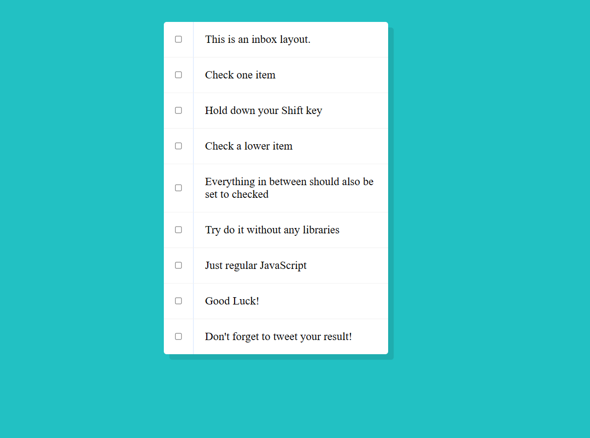

# Hold Shift to Check Multiple Checkboxes

## Description

Hold Shift to Check Multiple Checkboxes is a simple web application that demonstrates how to use the Shift key to select multiple checkboxes in a list. It showcases an inbox layout with checkboxes and provides the functionality to select a range of checkboxes by holding down the Shift key.

## Features

- List of items with checkboxes.
- Hold down the Shift key and click checkboxes to select a range.
- Selecting a checkbox range updates all checkboxes in between.

## Technologies Used

- HTML5
- CSS3
- JavaScript

## How to Use

1. Clone the repository or download the ZIP file.
2. Open `index.html` in your web browser to view the application.
3. Click on checkboxes while holding down the Shift key to see the effect.

## Screenshots

## How It Works

The application uses JavaScript to handle the logic for selecting checkboxes within a range when the Shift key is held down. The core logic is implemented in the `handleCheck` function, which calculates the range and updates the checkboxes accordingly.

## Credits

- Icon used in the project favicon is from [fav.farm](https://fav.farm/).
